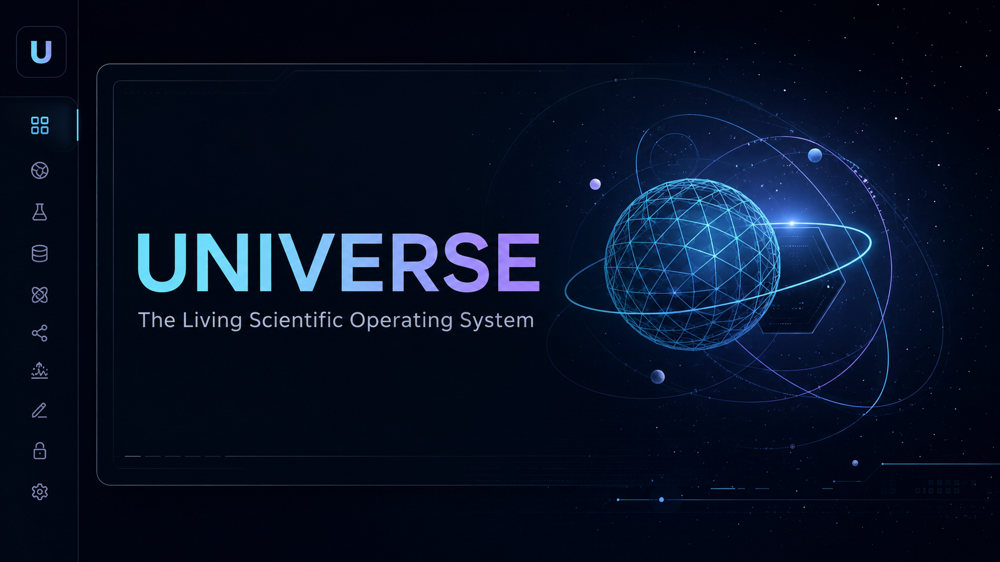

<div align="center">

# UNIVERSE

### Biswajit's private personal intelligence system

**Local-first · Voice-first · Agentic · Windows desktop**



</div>

UNIVERSE is private desktop software for scientific work, personal knowledge and permissioned PC
assistance. It combines a cinematic 3D command nexus, specialist agents, live scientific APIs,
explicit encrypted memory, plugins, simulations, writing tools and voice-to-voice conversation.

> Proprietary software. Copyright © Biswajit Jana. All rights reserved.

## Working capabilities

- **Command nexus:** responsive React Three Fiber core, radar/orbital motion, telemetry, agents and plugin status.
- **Voice:** one-click activation, persistent turn-to-turn listening, selectable Windows voices, spoken replies and interruption.
- **Agents:** Universe routes to Kepler, Vega, Newton, Muse or Atlas with streamed plans, progress, tools and cancellation.
- **General tools:** live worldwide weather, allow-listed music/app launching, local Ollama models, Gemini, NASA, arXiv and transparent simulations.
- **3D knowledge constellation:** interactive WebGL nodes, spatial links, focus tracing and cinematic node intelligence panels.
- **Private credentials:** Gemini/NASA/GitHub keys encrypted with Electron `safeStorage`; values are never readable from React.
- **Memory:** explicit-only AES-256-GCM records with search, deletion and a per-conversation Memory toggle.
- **Plugins:** versioned manifests, risk levels, declared capabilities and encrypted enable/disable state.
- **Atlas operator:** native file picker, token-scoped text reads, confirmed writes, private backups and two allow-listed apps.
- **Audit:** secret-redacted lifecycle and Atlas event history.
- **Privacy:** public source visibility with a proprietary license, `noindex`, local data and a server bound to `127.0.0.1`.

Atlas has no terminal, arbitrary command runner or unrestricted filesystem API.

Broad general knowledge requires either a Gemini key or an installed Ollama model. The bundled demo
provider is intentionally small and cannot behave like a general assistant. Live weather works without
an API key through Open-Meteo. Music commands open an allow-listed service after Atlas has been enabled;
account-level playback control is not claimed.

## Run locally

```powershell
npm install
Copy-Item .env.example .env.local
npm run desktop:dev
```

Browser-only development remains available with `npm run dev`. It cannot access encrypted desktop
credentials, encrypted memory or Atlas tools.

## Package for Windows

```powershell
npm run desktop:package
```

The NSIS installer is written to `release/`. Code signing requires Biswajit's Windows signing
certificate; unsigned local builds still package and run.

## API keys

In the packaged app, open **Settings → Private credentials**. Keys are protected by Windows and
activate after restarting UNIVERSE. For browser development only, use `.env.local`:

```env
GEMINI_API_KEY=replace_me
GEMINI_MODEL=gemini-3.5-flash
NASA_API_KEY=replace_me
```

Never commit `.env.local`, keys, tokens, passwords, memory exports or personal files.

## Private local AI with Ollama

[Ollama](https://ollama.com/download/windows) is optional. Install it on Windows, then download one model:

```powershell
ollama pull gemma3:4b
```

Start the packaged UNIVERSE app and open **Settings → Local intelligence**. Select the model and
choose **Local only** to guarantee that a failed local request never falls through to Gemini.
**Local first** can use Gemini as an explicit fallback. UNIVERSE accepts Ollama only over loopback
HTTP (`127.0.0.1`, `localhost`, or `::1`); remote model servers are rejected.

## Security boundaries

```text
Sandboxed renderer
  ├── localhost API -> orchestrator -> read-only plugins / encrypted memory
  └── typed preload -> permission broker -> selected file or allow-listed app

Electron main process
  ├── Windows-encrypted credentials
  ├── local server on 127.0.0.1:3199
  ├── native approvals
  └── redacted audit log + private backups
```

The renderer has `nodeIntegration: false`, `contextIsolation: true`, and no generic `fs`, `shell` or
`exec` bridge. See [desktop-architecture.md](docs/desktop-architecture.md).

## Validation

```powershell
npm test
npx tsc --noEmit
npm run build
npm run desktop:dir
npm run desktop:package
```

## Product direction

- [Master build prompt](docs/MASTER_BUILD_PROMPT.md)
- [Architecture](docs/architecture.md)
- [Desktop security architecture](docs/desktop-architecture.md)
- [Visual system](docs/design-system.md)
- [Roadmap](docs/roadmap.md)

## Ownership

This repository is publicly visible but remains proprietary software. Public source access does not
grant permission to redistribute, deploy, copy or create derivative works. See [LICENSE](LICENSE).
